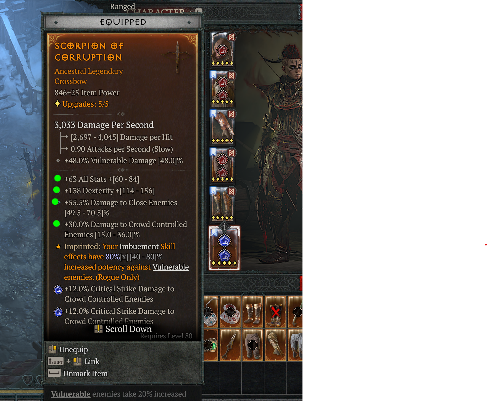

# Diablo 4 Optical Character Recognition

Proof of concept of app for going through endless loot looking for those good item rolls.

D4Ocr app reads screen and highlights wanted item stats to make it easier to sort out loot.
D4Ocr periodically scans your Diablo 4 game screen and renders custom overlay.

**_NOTE:_** IT DOES NOT MODIFY DIABLO 4 GAME IN ANY WAY!!!

Here's a screenshot on how D4Ocr identifies wanted item affixes on screen:

## Lessons learned

OCR provided to be useful when going through inventory in game. Sadly currently it's not performing fast enough to exceed experienced players reading speed when going through loot.

### TODO:
* Optimize scan speed and Tesseract configs!
* Write usage instructions
* Github release builds if this is actually useful.
* Highlight bad nightmare dungeon modifiers
* Possibility to filter item stat ranges

## Tech

### OCR

Project uses Tesseract open source wrapper for OCR.

https://github.com/charlesw/tesseract

And training models from:

https://github.com/tesseract-ocr/tessdata_fast

### Capturing game screen

Capturing desktop/game screen is done with native Windows interop and with legacy PInvoke library.
There's new CsWin32 library which uses code generation for interop calls

https://github.com/dotnet/pinvoke
https://github.com/microsoft/CsWin32
https://www.cyotek.com/blog/capturing-screenshots-using-csharp-and-p-invoke

### Overlay

Overlay is drawn by GameOverlay.Net library.

https://github.com/michel-pi/GameOverlay.Net

## Known problems / solutions

### Capture size is smaller than rendered size

Diablo 4 runs on borderless windowed resolution and uses dynamic resolution scaling which can be different from desktop resolution.
Game overlay runs in desktop resolution which means that there is need for scaling captured pixel coordinates into game resolution coordinates.

This is solved with configurable game resolution setting in app.config.

### Rectangle highlights caused next OCR captures to fail

Drawn highlights can obstruct screen captures. Highlights need to be carefully positioned not to overlap text.

### Poor performance

Currently it takes about 1-3 seconds to perform ocr for screen capture.
This probably can be improved with better Tesseract configuration. 
